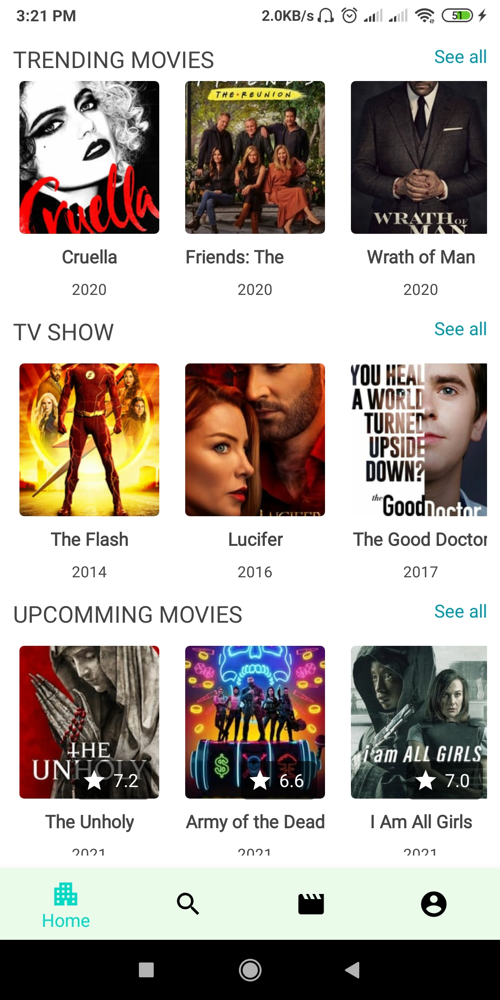
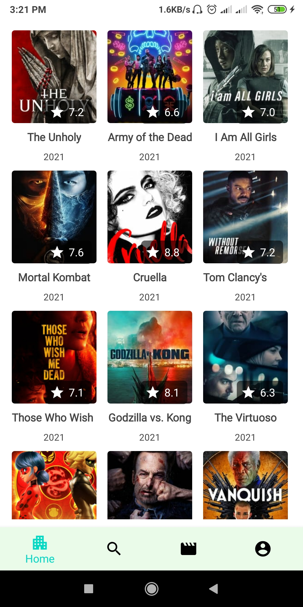

# Movie App in android with Jetpack, Kotlin, Coroutine, caching, livedata

### Uses technology

    1.  Kotlin
    2. Jetpack (Viewmodel, LiveData, Navigation, Paging)
    3. Coroutine
    4. Retrofit
    5. Glide
    6. MVVM Architecture
    7. Caching
    8. Logging Interceptor

